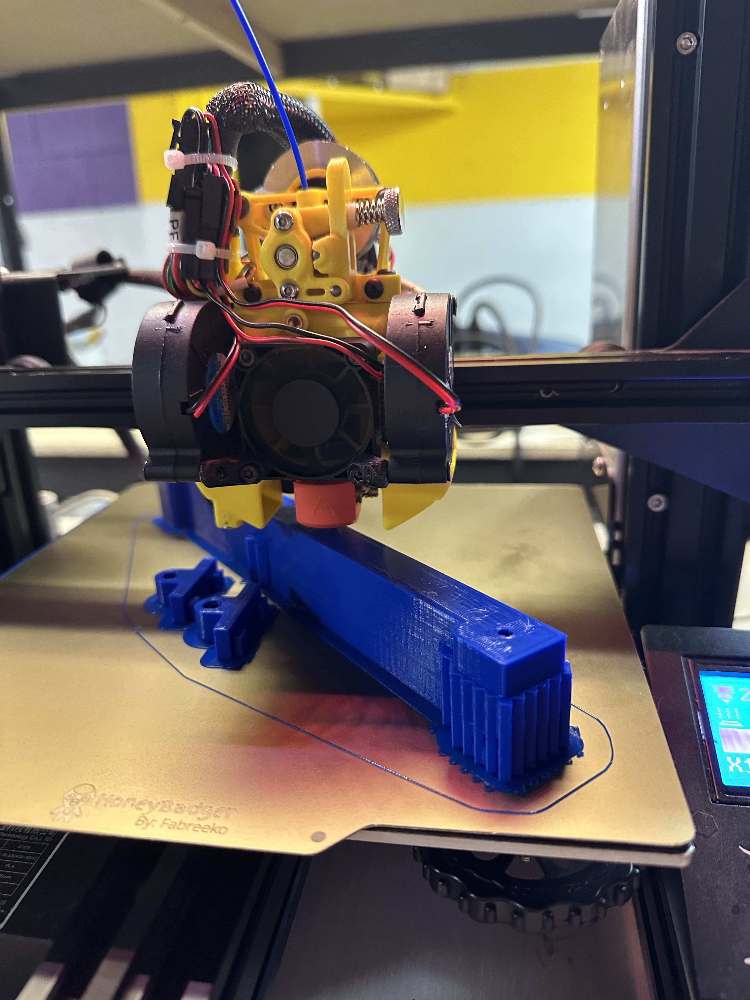

# Scope!
All the fun stuff with my scope project, from 3d models of parts to code to drive motors!

## Introduction - The Scope
I've had my Celestron G8N Scope for a couple decades at this point! Essential details:
*   8" Newtownian Reflector
*   1000 mm focal length (F/5)
*   German equatorial mount
*   Was motorized, but in several moves, I've lost the controller!

It has really nice optics.

The last time I had really used it was for the Solar Eclipse of 2017.  I had it set up with a solar filter and watched the moon slowly cover the sun until totality, then removed the filter for a minute of viewing unfiltered.  Probably not the smartest thing I've ever done (ie. I didn't have a countdown to warn me of the end of totality), but survived it with eyeballs intact!

Even before then, the tripod was having problems.  I had jerry-rigged some aluminum rails to hold things together when some of the tripod head adapters sheared off, and some other things like replacing a broken "spreader" arm with some light chain.

Then it went in a closet and wasn't used because it just wasn't very stable to work with.

## The Restoration
It started here in 2023.  I joined a "Maker Space" here in Knoxville (https://www.knoxmakers.org), and that gave me access to some nice, dialed-in 3d Printers.  I said to myself: "Self, you have the broken tripod heads, why don't you learn how to do CAD and make a 3D model you can print to fix those."  Mind you, it had been since 1992 since I had used CAD, back in my U of A days in Engineering where I had two different drafting courses, one CAD, one "graphite".  Things have changed in the 30 years intervening!

### CAD Software
First up, I needed to find something to model the parts out. I had done a bit with AutoDesk TinkerCAD, but after many hours trying to master it, I realized it just wasn't up to the task.  Then I found it...OnShape.

OnShape is a fully featured parametric CAD application that is Web based.  Being a cloud person, that web based part appeals to me!  The price tag ($1,500/year) might be a concern, except for one little thing:  If you are using it non-commercially, and you are OK with your files being public, you can use it for the considerably lower price of $0.  Those two constraints, particularly as I wasn't designing anything that I needed to maintain IP on, were right in line with my thinking, so now I have a free, fully featured parametric CAD program I can use!

### Modelling the Tripod Heads
Now, with a fresh set of digital calipers, and the right software for the job, off I went!  Many measurements, sketches and extrusions later, I had it!  (https://cad.onshape.com/documents/651a6b2bb48e90a68e66d1f7/w/767ca688b3749e94e705ed85/e/82735cdd387bd0fb9404a969).  

I patiently waited as the 3D printer did it's thing, and I put my first one into the tripod leg. It was snug enough to friction fit, and even needed a little percussive maintenance to get it to seat in, but damn if it didn't fit perfectly!  Screw holes matched up and everything.  Time to print the other 5 I needed to fix all of the legs and voila.  My scope stood, almost, again.

Remember, I said I had replaced one of the spreader arms with chain. Well, that was very unstable too...

### Spreader Arm
Back to OnShape, and 3D printer again.  This worked pretty well, I had the spreader arm itself (https://cad.onshape.com/documents/99fae31c21d5bba7519cbe2b/w/5f168d08e3776bcff6f6f038/e/573f38b5a7da80f062b495c7), but also some of the brackets that attach it to the tripod legs (https://cad.onshape.com/documents/3b5276b53847edbecf087472/w/d293d7bb09cffdce69df0657/e/4b34e97b3bc7e738fc32ab43).

OK, now the tripod was on a solid base, and the scope actually worked again!!!

### Back in the field!
Got the scope out and damn if it didn't still work. Resolving Epsilon Lyrae like a dream. Saturn was near opposition, so getting those rings in the eyepiece was amazing to do again!

But, it reminded me of how nice it was to have motorized control of the scope, both for tracking and for pointing!

## Usablility Improvements
### Polar Alignment
OK, so a German Equatorial mount means that the scope really should be carefully aligned with the North Celestial Pole (NCP) (unless you're down sount that is) for use. When that's done, you can follow anything in the sky by simply rotating round the "Right Assention" axis.  The old fashioned way to do this is to actually configure a spot in the mount as a mini telescope, and align a hole in the mount with Polaris.  Now Polaris isn't exactly at the pole, a little over 1/2 degree away from it. So you have a table that tells you how far and in what direction to offset where the scope is centered from Polaris to get a nice precise alignment.  All in this takes a considerable amount of time to do right.

Well, one of the nice things with technology is that it marches forward.  I found an iPhone App (PS Align Pro)that uses the iPhone's magentometer, accelerometers and gyroscopes to tell you when it's pointed at the NCP...so then, how to I get the iPhone alligned with the scope?  Well, there's this (https://cad.onshape.com/documents/3890b7d730e3e909bfeef603/w/2d1ace8f98bb9776969982ea/e/a4dd4d691836cd1095c0d60a)  Basically, it's something that fits into the scope's polar alignment "hole", and you stick the iPhone in it, and voila, they're alligned!  I was able to do a pretty solid polar alignment in under 5 minutes!  Is it precise enough for long-exposure astrophotography?  Hell, no. Is it close enough that I can easily track stars with one knob on the mount. You're damned right it is!

### Motor Drive
So, I had motors on both axes of the scope. I remember that they worked pretty well, even.  However, I had lost the controller for them.  What's more, Celestron had published, as close as I can estimate, ZERO documentation on the controller or the motors. The stepper motors didn't even have a model number on the outside of them.  I'm 99% sure that I could have connected them as standard 4-wire stepper motors to a driver and made them turn, but I had no documentation on how much current to stuff into them or anything like that. Odds are I would have destroyed them in short order.

What I did have was a nice standard NEMA 17 stepper motor and a controller for it sitting around...that and a bunch of ESP-32s that I had been tinkering with for a bit, including making them much more friendly for me by flashing them with a MicroPython environment, so my horribly lackluster C skills didn't have to interfere with this!

So, I cobbled together a test and yep, I could get the motor to turn, in either direction, using only 3 GPIO pins on the ESP32. Great. Back to the field for a bit...

I did some testing. After polar aligning the scope, I did some timing and found that I needed to turn the shaft on the RA axis once every 8 minutes to track a star reasonably well...I'll be tuning that wnen I get everything put together, but it was close enough that I could do some programming!

In order to track a star, I need to have a very steady, preictable, and tunable rate of rotation on my stepper motor.  How do you do that in a language like Python, while also listening for interrupts from incoming commands to center or slew the scope?

The ESP32 has a feature that was designed to drive Infrared LEDs to handle TV Remote Controllers.  This RMT feature is a 80 MHz hardware Pulse Width Modulation driver. What that means is that you can send a train of pulses at it in multiples of 12.5ns and tell it to play them in a loop for you, and it returns control of the processor to you without you needing to care about it...it will just send those pulses until you send it a command to stop.  So I went to work figuring out how long those pulses needed to be.

A few restrictions:
* You could apply a divisor to the clock from 1 to 255.
* You sent pulse widths to the system by passing a set of on-time, off-time pairs. If you wanted to be complicated these could be arbitrarily long, but for me, I just needed simple pulses, so I just defined them as equal on-off
* The maximum you could send as a length was 32,767 "ticks" of the clock (with the divisor applied)
* Given that, you could go from a divisor of 1, and a (1,1) pulse, would get 1/40,000,000s (25ns) up to a divisor of 255, and length of (32767,32767) for a length of 0.21s per pulse.

So, my motor was a pretty standard 200 pulses per revolution stepper motor. To do that over 8 minutes meant that I needed to send 200 pulses every 480 seconds or  0.416666s per pulse. That's not gonna work!

Enter "Microstepping".  The stepper controller I had suppored a feature that lets you reduce your step size in increments of powers of 2.  So you could go to 1/2, 1/4, 1/8, 1/16 or 1/32. Fancier controllers can sometimes go as far as 1/256!  Great, so I calculated it all out and figured I needed a divisor of 100 and a 1/32 microstep frequency of one ever 30,000 ticks.  Great, code it up and try it out.  Motor does great, slowly, every so slowly ticks around (had to put a masking tape flag on the shaft to see it moving!)

#### Mounting the Motor Drive
So somewhere about this time, as I was getting ready to pull out my callipers again and measure the mount and figure out how to attach the motor correctly, I found something out. My mount was a OEM branded Vixen GS mount. And that opened up a whole crap-ton of options for me...like people who had already modelled the motor mounting points for NEMA 17 motors for me!  That was sure convenient!  So, now I had mounting kits for the RA Axis (https://cad.onshape.com/documents/a0e97fc9d893149588df1703/w/372452575467602d709597c4/e/a4f8ea5177ab7342534c5a68) and Declination Axis (https://cad.onshape.com/documents/2c3e404075e115b9412a2a07/w/6dec58d26f44ae1cbff80baf/e/04076134f2d75f955bfe7468)  Whew, that saved me a bunch of effort!

Next I needed to get the power from the motor to the shaft.  OK, I decided to do this one myself. Measured the distance between them, and used a nice free OnShape plugin to design gears and created pair of gears (same size and count, so 1:1) and off to the 3D Printer again.  This time it was a PITA.  I didn't do my first set with tight enough tollerances so the shafts just spun under any torque, making them useless.  So, I spent a night doing a couple dozen mini-shaft interfaces that were 3mm thick and printed in minutes to fit exactly the two shafts.  Great, now we have a mount and we have the motor and axis coupled, let's see how it works.

Now's the point in the story that I realize that Microstepping is not a free-lunch kind of thing. In order to do microstepping, the controller is creating intermediate steps where the magnets and coils are partially energized and not alligned exactly.  Guess what that robs you of?  If you guessed "torque", you'd be right!  My 1/32 microstep meant that I had ~4% of the motor's full power availalbe to turn it with.  And unfortunately, that wasn't enough to actually turn the shaft!

I was just about to start working on a reduction gear setup, and all the complexity that goes with that, when I decide, well, let's see if a less aggressive microstep might have enough power. I mean, I was able to turn the shaft with my fingers and no leverage, so it couldn't be that much torque needed! Lo and behold, a 1/16 step was the ticket.  Clock divisor of 255 and (23,500,23,500) gave me the pulse width (150ms - rock solid measured on oscilloscope!) I needed and it seemed to be able to turn reliably! (Foreshadowing Alert!)

## Putting it all together...
So, now whate we have are three major components:
1. The scope itself
1. The electronics to drive the motors
1. The controller

### Scope
So, after some extended prints for the motor mounts and gears, finally got around to putting everything together!

The red gears on the RA axis, and the black gears on the declination axis. They are both 1:1 gear sets, and press-fit onto their respective shafts. The motor mount 3D prints have some room to adjust the exact position of the motor for gear meshing.

### Motor Driver Electronics
This part is pretty straightforward. Power comes from a Ryobi 18V battery and a plug-in for that. That power goes straight to the two motor controllers, and feeds into a buck converter to step it down to the 3.3v that the ESP32 needs to operate.

After doing a power consumption test on this with the following setup:
* Tripod and mount set up, RA motor connected and running at tracking speed
* Dec motor attached and set to "holding" current on stepper (ie. being held in place, not on scope)
* ESP32 running and receiving commands from controller
* Controller used to enable RA tracking and DEC holding modes

Discovered a few things...
* 18V 4Ah battery will run in that configuration for at least 4 hours. This is a worst case. Most of the time when observing, you won't have the DEC axis in holding mode...really no reason for it.
* The DEC motor in "holding" mode runs HOT.  Thermocouple measured it at about 70C...this is important. I had printed to motor mount for this motor in PLA, which begins to deform at about 60C!  Well, back to print it in ABS then!

### Controller
Got the controller dialed in nicely.  I included some buttons to calibrate and save the RA tracking speed to an EEPROM in the controller so I don't have to worry about changing my code to update it.  It sends commands reliably to the motor driver ESP32 and they get executed nicely.  Did a nice long (6 hours) test with the RA motor on the mount without the scope (foreshadowing alert!) and worked beautifully.  I even used a digital level to calibrate the speed before going out to the dark skies, calibrating the mount for 1 revolution ever 23h 56min (sideral day)

### Oops
OK, so I have everything printed and mounted. My first "Dammit" moment occurred when I hooked everything up and went to set the motor driver electronics down...the cable for the RA axis was just about right, but the dec cable was too short to sit below the scope.  No big deal, just need a stool to raise it off the ground (probably for the best...let's continue).

RA motor test:  Great, tracking nicely it appears.

Dec motor test...let's just skip the preliminaries and go to "Ludicrous Speed!"  Um...I don't like that sound...gears slipping past each other.  Turns out I had printed the RA gears with a lot of strength parameters turned up (6 layers of outer shell perimeters, 100% infill!), while I had forgot to make those changes for the dec motors (2 layers of shell, 20% infill), and the gear shafts were flexing. Grrr...

Then I checked the RA more closely. The motor sounded about right then I heard the charactaristic "click" of the stepper slipping.  Dammit, with the added mass of the scope on the mount, it didn't have enough torque to turn reliably!

So, with that I have two options to increase torque:  I could change the stepper from 1/16 to 1/8 microstepping.  The hardware pulse driver on I was using, however, had two limitations.  First, it suppored a clock divisor maximum of 255, and it had a maximum pulse width of 65,535 clock ticks.  I ran the numbers and at 1/8 step, I needed a full divisor of 255 and a pulse length of 100,000...too much for the hardware driver. I could do a software PWM, but that would be far less precise.  OK, Plan B.

I reworked my gears between the motor and shaft to be a 2:1 ratio.  So, now, my settings from the 1/16 stepping would work the same at 1/8 (with a 2:1 gear ratio now) PLUS, with that gear ratio, I could deliver double to torque to the shaft. So, I'd get more torque from the new microstepping setting + more torque from the gears!  And I had to reprint my dec gears anyway, so might as well add the torque to them too...7:24 minute print at high strength settings and voila.
.

https://s12d.com/JeffDGScope
